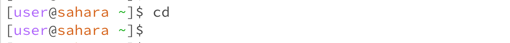

# Lab Report 1
**Command** `cd`

1. command with no arguments

- The working directory is /home.
- Without a specific argument here, we do not have a path to switch to from the current working directory. So the system simply prints out the current working directory which is /home in this example.
- This output is not an error.

2. command with a path to a directory as an argument

- The working directory is /home/lecture1.
- Since we are taking the directory lecture1/ as the argument of the `cd` command, this directory becomes our new current working directory after running the code. The new current working directory can be seen in the prompt.
- This output is not an error.

3. command with a path to a file as an argument

- The working directory is /home.
- We are trying to pass a file instead of a directory as the argument of the `cd` command, it contradicts the function of the `cd` command which enables us to move between different directories. Thus, the system reminds us that the input argument is not a directory and stays at the previous working directory.
- This output is an error because the system is expecting a directory as an argument, but instead a file is given.

**Command** `ls`

1. command with no arguments

- The working directory is /home.
- Since no path is given in this example, the system simply lists the files and folders of the /home directory.
- This output is not an error.

2. command with a path to a directory as an argument

- The working directory is /home.
- - The system lists all the files and folders of the given path after the code runs. The given path here is the lecture1/ directory, so Hello.java  messages  README are printed.
- This output is not an error.

3. command with a path to a file as an argument

- The working directory is /home.
- Since we are taking a file as an argument, there are no contents of that file to be listed. Then, the system just display the information of that specific file for us.
- This output is not an error.

**Command** `cat`

1. command with no arguments

- The working directory is /home.
- There is no response after the code runs, and even the prompt has gone. I believe this is because we do not have a given path and the system is waiting for such an argument to further process.
- This output is not an error.

2. command with a path to a directory as an argument

- The working directory is /home.
- The system reminds us that our input argument is a directory but the `cat` command is used to print the contents of a given file.
- This output is an error since a file is expected but a directory is given.

3. command with a path to a file as an argument

- The working directory is /home.
- The content of the given path is printed. The given path is /home/lecture1/messages/zh-cn.txt in this example and the according content of message 你好世界 is printed correctly.
- This output is not an error.
