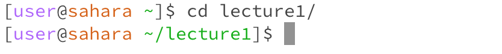

# Lab Report 1
**Command** `cd`
1. command with no arguments

- The working directory is /home.
- Since there is no argument here, we do not have a path to switch into from the current working directory. So the system simply print out the current working directory which is /home in this example.
- This output is not an error.

2. command with a path to a directory as an argument

- The working directory is /home/lecture1.
- Since we are taking the directory lecture1/ as the argument of the cd command, this directory becomes our new current working directory after running the code. The new current working directory can be seen in the prompt.
- This output is not an error.

3. command with a path to a file as an argument

- The working directory is /home.
- We are trying to pass a file instead of a directory as the argument of the cd command, it contradicts with the function of cd command which it enables us to move between different directories. Thus, the system remind us that the input argument is not a directory and stays at the previous working directory.
- This output is an error because the system is expecting a directory as an argument, but instead a file is given.

**Command** `ls`
1. command with no arguments

