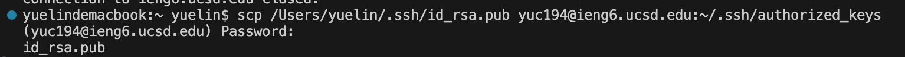
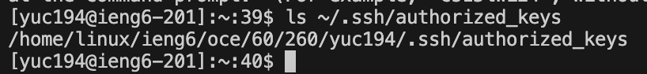

# Lab Report 2

**Part 1**
**Code of** `ChatServer`
```
import java.io.IOException;
import java.net.URI;

class Handler implements URLHandler {
    String chat = "";

    public String handleRequest(URI url) {
        if (url.getPath().equals("/")) {
            return "No message entered yet.";
        }
        if (url.getPath().equals("/add-message")) {
            String query = url.getQuery();

            int firstEqual = query.indexOf('=');
            int ampersand = query.indexOf('&');
            int secondEqual = query.lastIndexOf('=');

            String message = query.substring(firstEqual + 1, ampersand);
            String user = query.substring(secondEqual + 1);

            chat += user + ": " + message + "\n";

            return chat;
        }
        return "404 Not Found!";
    } 
}   


class ChatServer {
    public static void main(String[] args) throws IOException {
        if(args.length == 0){
            System.out.println("Missing port number! Try any number between 1024 to 49151");
            return;
        }

        int port = Integer.parseInt(args[0]);

        Server.start(port, new Handler());
    }
}
```


* The `handleRequest` method is called.
* The `URI url` argument is passed to the `handleRequest` method. In this example, the value of `url` is the `/add-message?s=Hello&user=jpolitz`. The relevant field in `Handler` class is `chat` being an empty string initially.
* The `chat` field is updated to "jpolitz: Hello\n" after processing the request.


* The `handleRequest` method is called.
* The `URI url` argument is passed to the `handleRequest` method. In this example, the value of `url` is the `/add-message?s=How are you&user=yash`. The relevant field in `Handler` class is `chat` being `"jpolitz: Hello\n"` before the request.
* After this request, the `chat` is updated to `"jpolitz: Hello\nyash: How are you\n"`.


**Part 2**
* The absolute path to the private key

* The absolute path to the public key

* The terminal interaction


**Part 3**
*  I learned about the process of securely connecting to a remote server using SSH. When we connect for the first time, we will see a message asking if we trust the server. This is a security step to make sure we are connecting to the right server and not to someone else pretending to be that server. This step helps keep your connection safe and secure.
*  I also learned to create my own simple web server using Java. I learned how the server takes in requests from the web and gives back responses based on what the request was about. It was like setting up different responses for different addresses and questions.
