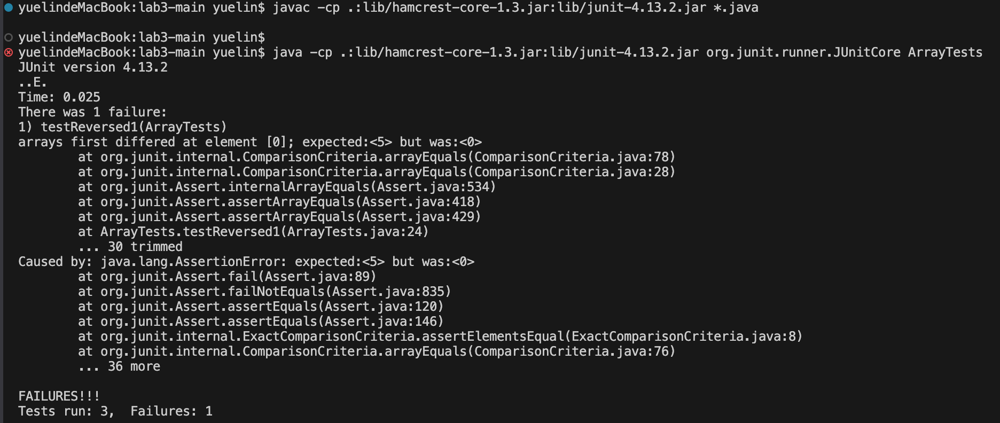

# Lab Report 3

**Part 1**

The method with bug I chose from `ArrayExamples.java`
```java
public class ArrayExamples {

// Returns a *new* array with all the elements of the input array in reversed
  // order
  static int[] reversed(int[] arr) {
    int[] newArray = new int[arr.length];
    for(int i = 0; i < arr.length; i += 1) {
      arr[i] = newArray[arr.length - i - 1];
    }
    return arr;
  }
}
```

* A failure-inducing input for the buggy program, as a JUnit test and any associated code
```java
public class ArrayTests {
  @Test
  public void testReversed1() {
    int[] input1 = {1, 2, 3, 4, 5};
    int[] expectedOutput1 = {5, 4, 3, 2, 1};
    int[] actualOutput1 = ArrayExamples.reversed(input1);
    assertArrayEquals(expectedOutput1, actualOutput1);
```

* An input that doesn't induce a failure, as a JUnit test and any associated code
```java
public class ArrayTests {
  @Test
  public void testReversed2() {
    int[] input2 = { };
    assertArrayEquals(new int[]{ }, ArrayExamples.reversed(input2));
```

* The symptom, as the output of running the tests


* The bug, as the before-and-after code change required to fix it
  - before code change
  ```java
  static int[] reversed(int[] arr) {
    int[] newArray = new int[arr.length];
    for(int i = 0; i < arr.length; i += 1) {
      arr[i] = newArray[arr.length - i - 1];
    }
    return arr;
  }
}
  ```
 - after code change
 ```java
 static int[] reversed(int[] arr) {
    int[] newArray = new int[arr.length];
    for (int i = 0; i < arr.length; i++) {
        newArray[arr.length - i - 1] = arr[i];
    }
    return newArray;
}
 ```
* Descrption of why the fix addresses the issue
The code before change modifying the input array `arr` directly to reverse the array, and doing so it uninitialized the `newArray` values. Thus, causing the error and failing the test. The fix resolves the issue by accurately reversing the array. The new version of the code uses a new array to store reserved elements and determining the placement for each element from the original array into this new array correctly. It fixes the logic of reversing the elements of an array.

**Part 2**
**Command `grep`**

* option 1
* -c, --count Only a count of selected lines is written to standard output.
1. ```java
grep -c "DNA" ./technical/biomed/1471-2431-2-1.txt
17
```
2. ```java
grep -c "political" ./technical/government/Media/agency_expands.txt
0
```
	-The `grep -c` counts the number of lines that contains the inout word within the designated file. It is useful as it quickly summarize if the interested word are found in the file and shows the frequency of the word.

* option 2
* -U, --binary Search binary files, but do not attempt to print them.
1. ```java
   grep -U "8" ./technical/biomed/1471-2105-3-24.txt
        approximately every thousand base pairs [ 7 8 9 ] . Given
        conserved regions [ 18 ] . An analysis of homologous
        was performed on 231 genes and 6185 mutations and of those
        we found that 84.0% had conservation ratios less than one.
        mutations and, of those, 88.0% had conservation ratios less
        draft genome [ 23 5 7 8 9 ] . Determination of which
   ```
2. ```java
   grep -U "into" ./technical/plos/journal.pbio.0020028.txt
        it is degraded or excreted; it must get into those cells, link up with its intracellular
        “Compounds were pushed into the clinic prematurely.” Sirna began as the biotech startup
        cell, a dsRNA molecule is cleaved into segments approximately 22 nucleotides long, called
        significant insight into the function of the gene and determine whether reducing its
        Injected into the bloodstream, unmodified RNA is rapidly excreted by the kidneys or
        into the tail. The RNA got to the liver, silenced Fas, and protected the mice from
        questions about whether that will translate into effective therapy.
        trials may deliver the RNA by direct injection into the target tissue (for a tumor,for
   ```
   - `grep -U` treats the file as binary during the search. This helps to prevent misinterpretating of the pattern that are being search for wothout confusion from file formatting differences. 

* option 3
* -A num, --after-context=num Print num lines of trailing context after each match.
1. ```java
   grep -A 1 "computerized" ./technical/911report/chapter-1.txt
    When he checked in for his flight to Boston, Atta was selected by a computerized prescreening system known as CAPPS (Computer Assisted Passenger Prescreening System), created to identify passengers who should be subject to special security measures. Under security rules in place at the time, the only consequence of Atta's selection by CAPPS was that his checked bags were held off the plane until it was confirmed that he had boarded the aircraft. This did not hinder Atta's plans.
   ```
2. ```java
   grep -A 3 "followed" ./technical/plos/journal.pbio.0020040.txt
        +/− mice of controlled genetic background and followed the fate of the 
        Trp53 wild-type allele in the tumours. According to the two-hit model, it
        was expected that in these tumours this copy would have been lost or inactivated. However,
        this turned out not to be the case. Half of the tumours from mice younger than 18 months
   ```
   - `grep -A` command takes in the input word and finds it in the file, then prints the input number of lines as the next lines after it for the additional text. It helps when looking through a large file of text, sorts out only the useful information.
     
* option 4
* -i, --ignore-case Perform case insensitive matching.
1. ```java
   grep -i "united kingdom" ./technical/plos/journal.pbio.0020161.txt
        Wellcome Trust in the United Kingdom. In particular, they seek the independence and
        Trust's Genome Campus at Hinxton, near Cambridge, United Kingdom. ‘The French and Germans
        United Kingdom, reported a year later, in April 2003. It endorsed the creation of an ERC as
   ```
2. ```java
   grep -i "atp" ./technical/biomed/1471-230X-2-23.txt
        ] , ATP [ 4 5 ] , and bile salts [ 6 ] . In addition to the
   ```
   - `grep -i` command would find the input word within the file regardless if it is capitalized or not, as `-i` is case-insensitive. Where it allows for flexible and inclusive searches by ignoring case sensitvity in the files.

All command line descriptions are found in Visual Studio Code with command `man grep`.
