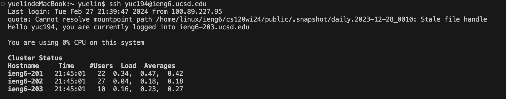
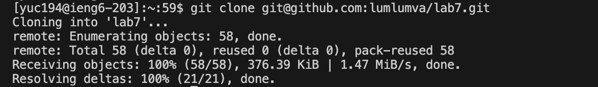
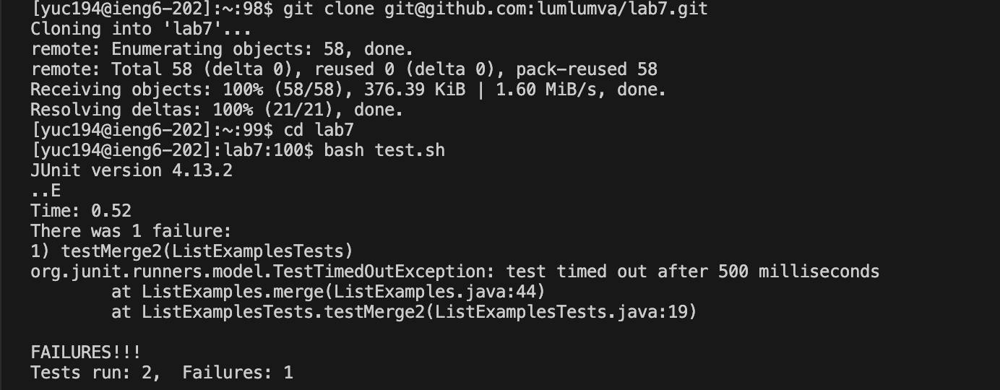
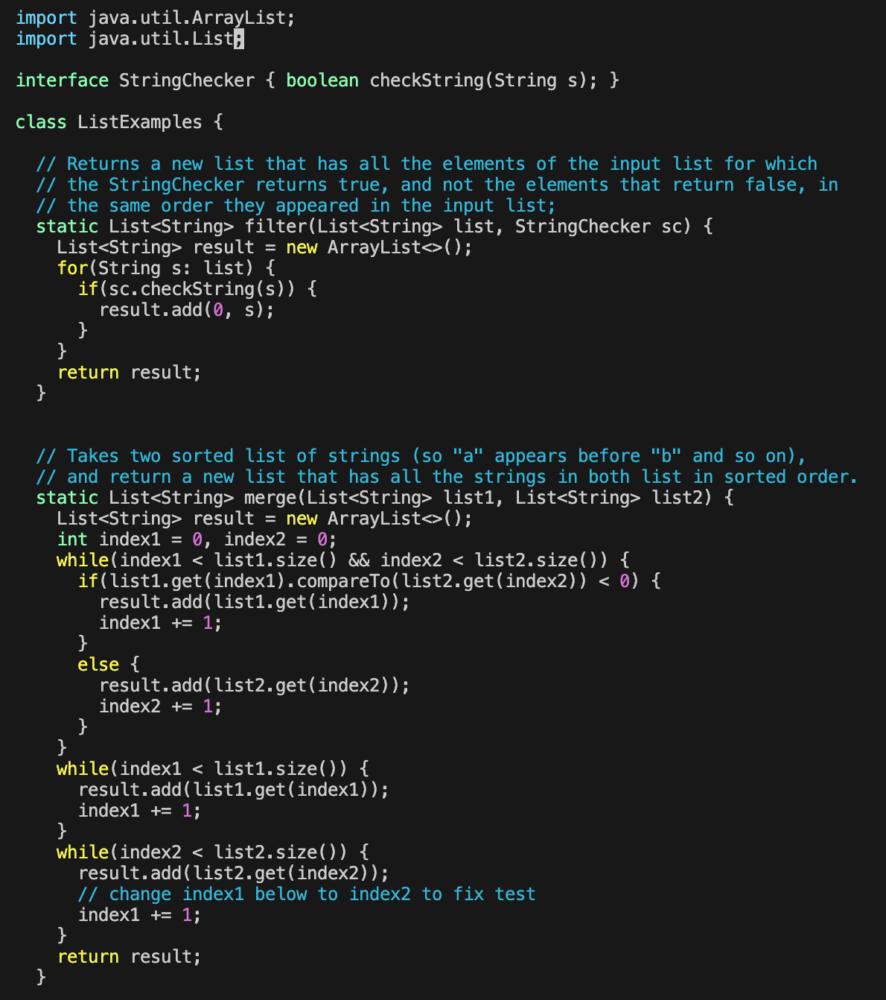
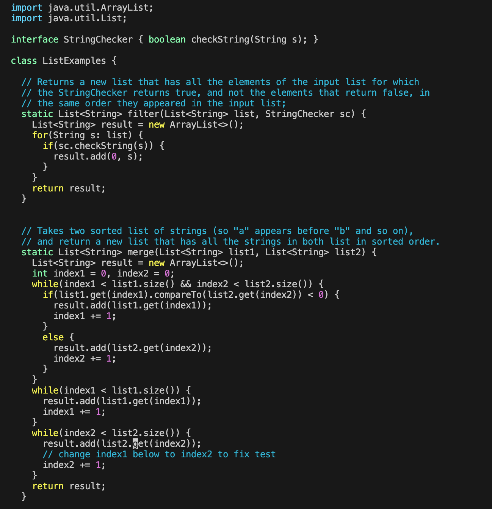
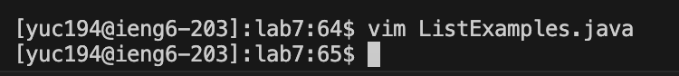
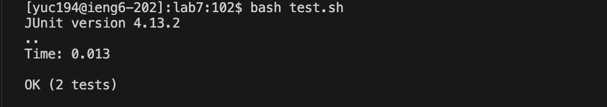
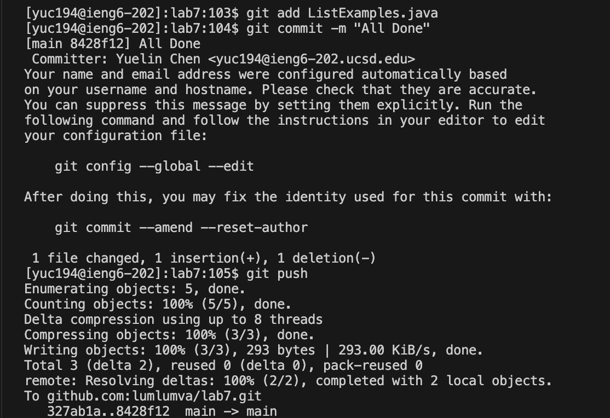

# Lab Report 4

**Step 4 Log into `ieng6`**
- Keys: `ssh yuc194@ieng6.ucsd.edu <enter>`
- Pressing the keys `ssh yuc194@ieng6.ucsd.edu` and then pressing `<enter>`, I am able to initiated an SSH connection to the ieng6 server with my school account. This command establishes a secure command line session with the remote server, and enable me to execute commands and interact with the server's resources.

**Step 5 Clone your fork of the repository from your Github account**
- Keys: `git clone git@github.com:lumlumva/lab7.git <enter>`
- Pressing the keys allows me to create a local copy of the repository located at `git@github.com:lumlumva/lab7.git`. This command clones the repository into a new directory, and sets up remote tracking branches for each branch in the repo. It enables me to work and edit the files locally and then push those changes back to the remote repository on GitHub.

**Step 6 Run the tests, demonstrating that they fail**
- Keys: `cd lab7 <enter>`
- Pressing the keys allows me to change the working directory into what I want, which is `lab7`.

- Keys: `ls <enter>`
- Pressing the keys makes it to show the contents conatined in my current working directory.

- Keys: `bash test.bh <enter>`
- After knowing what is the test file from the last key, we now run `bash test.bh <enter>` to execute the JUnit tests. It demonstrates that there is 1 test fail.

**Step 7 Edit the code file to fix the failing test**
- Keys: `vim ListExamples.java <enter>`
- Pressing the keys makes it to open the file `ListExamples.java` in Vim.

- Keys: `43j, 11l, r, 2`, `<esc>`, `:wq <enter>`
- Pressing the key `j` 43 times to go down through the lines, and press the key `l` 11 times to the right to be at the position of 1 of the variable name `index1`. Then press `r` key to enter into insert mode and select the index of the number 1, continue with the pressing of key `2`, this would successfully change the variable `index1` to `index2`. Next, press the `<esc>` key to exit out of insert mode and back into normal mode. Lastly, enter command `:wq` to save and exit out of Vim.

**Step 8 Run the tests, demonstrating that they now succeed**
- Keys: `bash test.sh`
- Pressing the keys to execute the JUnit tests. And now it demonstrates that all the tests are passed successfully.

**Step 9 Commit and push the resulting change to your Github account**
- Keys: `git add ListExamples.java <enter>`, `git commit -m "All Done" <enter>`, `git push <enter>`
- Pressing the keys `git add ListExamples.java <enter>` add file changes in my working directory. Further, pressing the `git commit -m "All Done" <enter>` allows us to commit the changes to the repository's history with the message "All Done". And the last one pushes all the committed changes to the remote repository.

