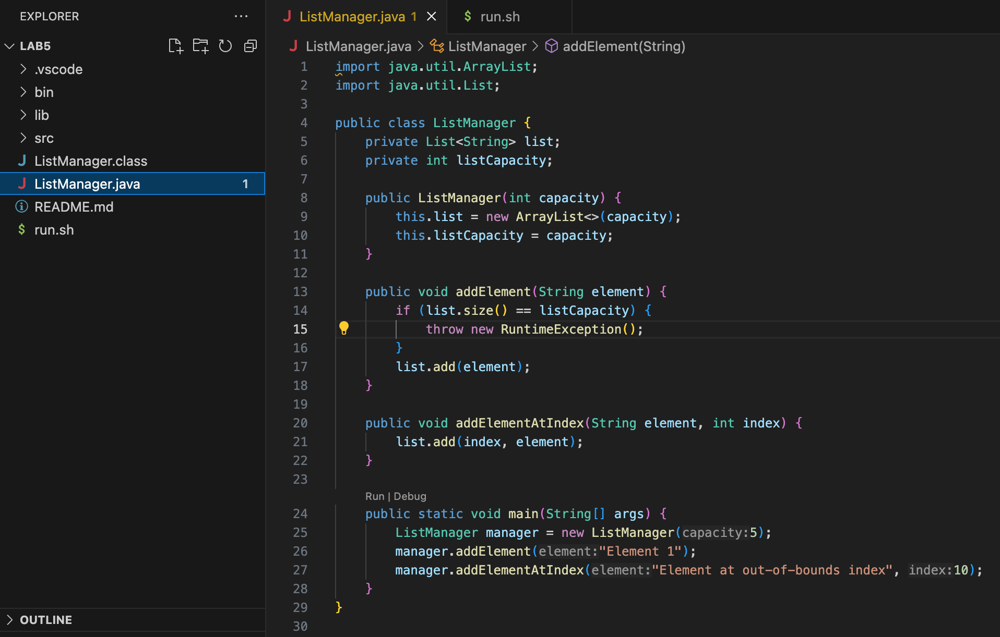
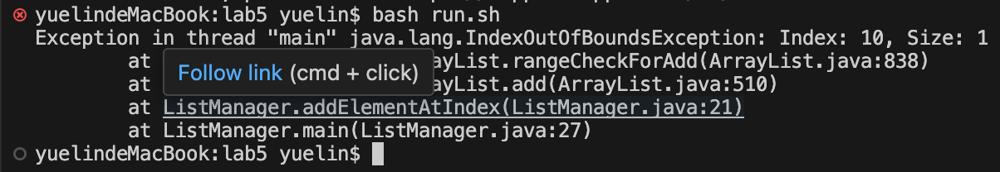
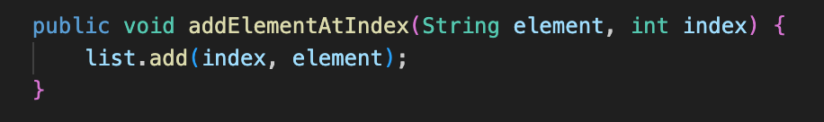
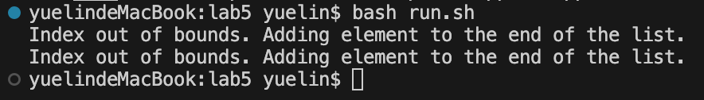
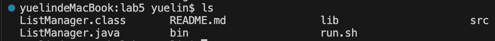
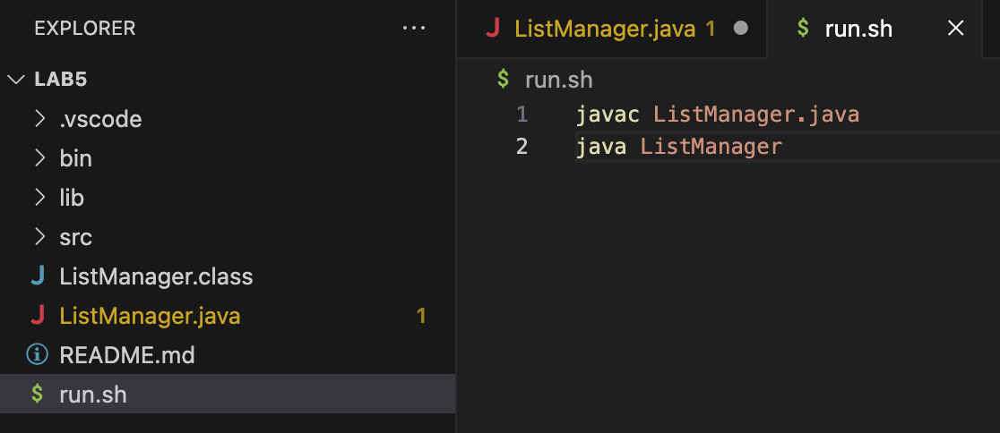

# **Lab Report 5**
## **Part 1 - Debugging Scenario**

**Original Post by Student**

Hello!

I'm working on the method for my list where it suppose to add elements to the list that has reached the max capacity. However, I have encounter an `IndexOutOfBoundExcpetion`. I thought that the `ArrayList` would automatically be resize as being a part of the Java function. Here is the output of the error that I am getting attached below: 


The list are specified with a capacity at the beginning, and I have added elements to check for the fullness of the list before adding a new element into the list. Could the bug being the fullness check is incorrect, or my understnading of the `ArrayList` that are handling full are wrong?

**Response from TA**

Hi there,

The `IndexOutOfBoundsException` typically occurs when you try to access or insert an element at an index that doesn't exist. However, the `ArrayList` does resize automatically, but when manually checking its capacity before adding elements, you might be comparing against the wrong value. Could you verify if the index at which you're trying to add the element exceeds the list's current size? Also, you could try to use the `size()` method to check if the list is full?

**Follow-Up by Student**

Thanks for the suggestion! After reviewing my code, I did notice on my mistake, which is how the way I check for the fullness of the list. Here was the problematic part of my code:

I have realized that the `ArrayList` handles its own resizing, I have mistakenly assumed that specifying any index within the capacity limit that I initially set for the `ArrayList` would be valid. But the actual list size and how the `ArrayList` manages capacity are different. With that, I adjust the `addElementAtIndex` method to add elements within the actual size of the list, hence the corrected code would output the correct output:

Where the index that are out of bound being added to the end of the list instead of the specified out of bounds index.
Thanks for the help!

**File and Directory Structure**
-   `ListManager.java`
-   `run.sh`
  

**Contents of the Files**
- `ListManager.java` with the bug before fixing
  
- `run.sh`
  

**Command to Trigger the Bug**
`bash run.sh`, are the command to run in the terminal for the bug to be triggered

**How to Fix the Bug**
- Fix the bug by ensuring the element that are being added are within the current size of the list. Which is the methods changes from
```java
public void addElement(String element) {
        if (list.size() == listCapacity) {
            throw new RuntimeException();
        }
        list.add(element);
    }

    public void addElementAtIndex(String element, int index) {
        list.add(index, element);
    }

    public static void main(String[] args) {
        ListManager manager = new ListManager(5);
        manager.addElement("Element 1");
        manager.addElementAtIndex("Element at out-of-bounds index", 10);
    }
```
changes into the corrected methods
```java
public void addElement(String element) {
        if (list.size() == listCapacity) {
            throw new RuntimeException();
        }
        list.add(element);
    }

    public void addElementAtIndex(String element, int index) {
        if (index >= 0 && index <= list.size()) {
            list.add(index, element);
        } else {
            System.out.println("Index out of bounds. Adding element to the end of the list.");
            list.add(element);
        }
    }

    public static void main(String[] args) {
        ListManager manager = new ListManager(5);
        manager.addElement("Element 1");
        manager.addElementAtIndex("Element at index 2", 2);
        manager.addElementAtIndex("Element at out-of-bounds index", 10);
    }
}
```

## **Part 2 - Reflection**
Learning Vim and shell scripting has been incredibly beneficial throughout the course. Vim, with its powerful editing capabilities, made it easy to write and modify code quickly without leaving the terminal. Its efficiency and the shortcuts for navigating through files and making edits significantly sped up my coding process. On the other hand, shell scripting opened up a world of automating repetitive tasks. Writing scripts to compile, run tests, and deploy my projects saved me a lot of time and effort. Allowing me to manage files, directories, and processes more effectively. Together, Vim and shell scripting not only made me more productive but also deepened my understanding of how systems work. They are tools that I will continue to use beyond the course, proving their lasting value in my development toolkit.
